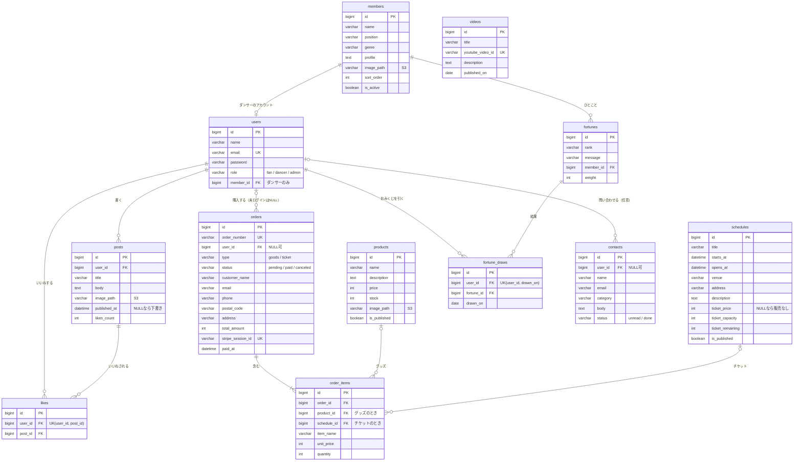

# ER図

> 各カラムの詳しい説明は [テーブル定義](./tables.md) を参照。
> 記法：`||` = ちょうど1、`o|` = 0か1、`|{` = 1以上、`o{` = 0以上。

```mermaid
erDiagram
    members ||--o| users : "ダンサーのアカウント"
    members ||--o{ fortunes : "ひとこと"
    users ||--o{ posts : "書く"
    users ||--o{ likes : "いいねする"
    posts ||--o{ likes : "いいねされる"
    users |o--o{ orders : "購入する（未ログインはNULL）"
    orders ||--|{ order_items : "含む"
    products |o--o{ order_items : "グッズ"
    schedules |o--o{ order_items : "チケット"
    users ||--o{ fortune_draws : "おみくじを引く"
    fortunes ||--o{ fortune_draws : "結果"
    users |o--o{ contacts : "問い合わせる（任意）"

    users {
        bigint id PK
        varchar name
        varchar email UK
        varchar password
        varchar role "fan / dancer / admin"
        bigint member_id FK "ダンサーのみ"
    }
    members {
        bigint id PK
        varchar name
        varchar position
        varchar genre
        text profile
        varchar image_path "S3"
        int sort_order
        boolean is_active
    }
    schedules {
        bigint id PK
        varchar title
        datetime starts_at
        datetime opens_at
        varchar venue
        varchar address
        text description
        int ticket_price "NULLなら販売なし"
        int ticket_capacity
        int ticket_remaining
        boolean is_published
    }
    products {
        bigint id PK
        varchar name
        text description
        int price
        int stock
        varchar image_path "S3"
        boolean is_published
    }
    orders {
        bigint id PK
        varchar order_number UK
        bigint user_id FK "NULL可"
        varchar type "goods / ticket"
        varchar status "pending / paid / canceled"
        varchar customer_name
        varchar email
        varchar phone
        varchar postal_code
        varchar address
        int total_amount
        varchar stripe_session_id UK
        datetime paid_at
    }
    order_items {
        bigint id PK
        bigint order_id FK
        bigint product_id FK "グッズのとき"
        bigint schedule_id FK "チケットのとき"
        varchar item_name
        int unit_price
        int quantity
    }
    videos {
        bigint id PK
        varchar title
        varchar youtube_video_id UK
        text description
        date published_on
    }
    posts {
        bigint id PK
        bigint user_id FK
        varchar title
        text body
        varchar image_path "S3"
        datetime published_at "NULLなら下書き"
        int likes_count
    }
    likes {
        bigint id PK
        bigint user_id FK "UK(user_id, post_id)"
        bigint post_id FK
    }
    fortunes {
        bigint id PK
        varchar rank
        varchar message
        bigint member_id FK
        int weight
    }
    fortune_draws {
        bigint id PK
        bigint user_id FK "UK(user_id, drawn_on)"
        bigint fortune_id FK
        date drawn_on
    }
    contacts {
        bigint id PK
        bigint user_id FK "NULL可"
        varchar name
        varchar email
        varchar category
        text body
        varchar status "unread / done"
    }
```

`videos` はほかのテーブルとつながりがないため、図では単独で置いている。`created_at`・`updated_at` は全テーブルにあるが、図では省略している。
